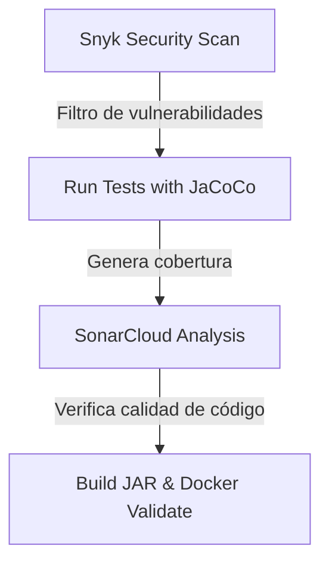

# Proyecto Biblioteca DUOC - Microservicio de Gestión de Préstamos

## 🎓 Contexto Académico
* **Institución:** DUOC UC - Escuela de Informática y Telecomunicaciones
* **Asignatura:** DOY0101 - Ingeniería DevOps
* **Evaluación:** Evaluación Parcial 2 (EP2) - Añadiéndole complejidad a nuestro pipeline
* **Sección:** Sección de Ingeniería en Informática
* **Integrantes y Responsabilidades:**
  * **Marco** (Integrante 1): Responsable Técnico (Infraestructura, Docker, GitHub Actions, Seguridad, Cobertura).
  * **Compañera** (Integrante 2): Responsable de Aseguramiento de Calidad y Documentación (README, Evidencias, Ramas).

---

## 📝 Descripción del Microservicio
**bibliotecaduoc** es un microservicio construido sobre el ecosistema **Spring Boot 3.5.0**, que implementa una arquitectura desacoplada para la administración de solicitudes de préstamos de libros dentro de la biblioteca institucional. 

El sistema gestiona de forma interna (en memoria a través de colecciones optimizadas) los registros de los préstamos, incluyendo variables como el RUT del solicitante, código de libro, fechas de solicitud y entrega, cantidad de días autorizados y cálculo de multas asociadas. 

---

## 🎯 Objetivos de la Evaluación (Rúbrica Notion)
De acuerdo a la planificación estratégica obtenida desde nuestra página de Notion, esta entrega tiene como objetivo principal consolidar una cultura de integración y entrega continuas a través de los siguientes indicadores de evaluación:

* **IE1 (Uso de Contenedores):** Crear un archivo de empaquetado optimizado mediante un `Dockerfile` reproducible.
* **IE2 (Pruebas Automatizadas):** Integrar la suite de pruebas unitarias al pipeline y medir la cobertura de código.
* **IE3 (Seguridad y Calidad):** Incorporar auditorías automáticas de dependencias (Snyk) y análisis de código estático en la nube (SonarCloud).
* **IE4 (Trazabilidad y Despliegue):** Configurar y validar de punta a punta un flujo de integración continua mediante GitHub Actions, simulando fases de construcción y empaquetado.
* **IE5 (Orquestación):** Diseñar una plantilla de orquestación de servicios reproducible con `docker-compose.yml`.

---

## 🛠️ Tecnologías Utilizadas

* **Lenguaje:** Java 21 (Eclipse Temurin)
* **Framework:** Spring Boot 3.5.0
* **Gestor de Dependencias:** Maven 3.9+
* **Contenedores:** Docker & Docker Compose
* **Pipeline CI/CD:** GitHub Actions
* **Análisis de Cobertura:** JaCoCo (Java Code Coverage)
* **Escaneo de Seguridad:** Snyk Security Scan
* **Análisis de Deuda Técnica:** SonarCloud

---

## 📌 Requisitos Previos

Antes de clonar y ejecutar el proyecto, asegúrate de tener instalado en tu máquina local:
1. **Java Development Kit (JDK) 21**
2. **Apache Maven 3.9+**
3. **Docker Desktop** (que incluya Docker Compose)
4. Un cliente REST o navegador web para probar endpoints (ej. `curl` o Postman).

---

## 💻 Guía de Ejecución Local

### 1. Construcción y Ejecución con Maven (Nativo)

Para compilar el proyecto y levantar el microservicio de forma directa sin contenedores:

```bash
# Limpiar, compilar y empaquetar el proyecto
mvn clean package

# Ejecutar el archivo JAR compilado
java -jar target/bibliotecaduoc-0.0.1-SNAPSHOT.jar
```
*El servicio se levantará localmente en el puerto `8082`.*

---

### 2. Pruebas Automatizadas y Cobertura (JaCoCo)

Para correr la suite de pruebas unitarias y generar de manera simultánea el reporte de cobertura:

```bash
mvn clean verify
```
* **Reporte de Cobertura:** Una vez finalizado el comando, el informe HTML de JaCoCo estará disponible en:
  `target/site/jacoco/index.html`

Para revisar el detalle del listado completo de instrucciones y fases Maven de la entrega, consulta: [docs/comandos.md](file:///Users/brani/Documents/Devops/evaluacion-parcial-2-devops-1/docs/comandos.md).

---

### 3. Ejecución Contenerizada (Docker)

Si deseas levantar el servicio empaquetado en un contenedor Docker individual:

```bash
# Construir la imagen Docker localmente
docker build -t bibliotecaduoc:latest .

# Ejecutar el contenedor mapeando el puerto 8082
docker run -d -p 8082:8082 --name bibliotecaduoc-container bibliotecaduoc:latest
```

---

### 4. Orquestación Reproducible (Docker Compose)

Para levantar el entorno completo de forma rápida y automatizada utilizando Docker Compose:

```bash
# Construir las imágenes y levantar el servicio
docker compose up --build

# Apagar el entorno limpiando contenedores y redes
docker compose down
```
*El microservicio estará disponible inmediatamente en `http://localhost:8082`.*

---

## 🔌 Endpoints Disponibles (API REST)

El microservicio expone los siguientes endpoints bajo el puerto `8082` para interactuar con la lógica de préstamos:

| Método | Endpoint | Descripción | Respuesta Esperada (Vacío inicial) |
| :--- | :--- | :--- | :--- |
| **GET** | `/api/v1/solicitudes` | Lista todas las solicitudes de préstamo en memoria. | `[]` (HTTP 200 OK) |
| **GET** | `/api/v1/solicitudes/ordenados` | Lista las solicitudes ordenadas ascendentemente por su ID. | `[]` (HTTP 200 OK) |
| **GET** | `/api/v1/solicitudes/{id}` | Busca una solicitud específica según su identificador único. | Objeto o `null` |
| **POST** | `/api/v1/solicitudes` | Registra una nueva solicitud. Requiere cuerpo JSON válido. | Objeto creado |
| **PUT** | `/api/v1/solicitudes/{id}` | Actualiza los datos de una solicitud de préstamo existente. | Objeto modificado |
| **DELETE**| `/api/v1/solicitudes/{id}` | Elimina del registro la solicitud con el ID indicado. | `true` / `false` |

> [!NOTE]
> Las llamadas detalladas de prueba mediante `curl` se encuentran documentadas en [docs/comandos.md](file:///Users/brani/Documents/Devops/evaluacion-parcial-2-devops-1/docs/comandos.md).

---

## ⚙️ Arquitectura del Pipeline CI/CD (GitHub Actions)

El ciclo de integración continua (CI) está configurado en el archivo `.github/workflows/main.yml`. Su función es automatizar la validación técnica en cada push o Pull Request en las ramas `main`, `develop` y las ramas funcionales `feature/*`.

El pipeline consta de **cuatro etapas secuenciales** diseñadas para asegurar la calidad y seguridad de la entrega:



### Detalle de las Etapas del Pipeline

1. **Snyk Security Scan:**
   * **Propósito:** Analiza las dependencias declaradas en el `pom.xml` para detectar vulnerabilidades conocidas en librerías de terceros.
   * **Seguridad activa:** Evalúa de acuerdo a un umbral de severidad alto (`--severity-threshold=high`). Cuenta con la propiedad `continue-on-error: true` para fines de trazabilidad académica sin bloquear la compilación del estudiante.

2. **Run Tests with JaCoCo:**
   * **Propósito:** Gatilla la compilación y ejecución de la suite de pruebas mediante `mvn clean verify`. 
   * **Evidencia:** Sube automáticamente el reporte HTML generado por JaCoCo (`jacoco-report`) como un artefacto descargable desde la ejecución del workflow de GitHub Actions.

3. **SonarCloud Analysis:**
   * **Propósito:** Envía el código fuente y los reportes de cobertura a la plataforma en la nube SonarCloud.
   * **Métricas:** Evalúa la mantenibilidad del código, duplicación, malas prácticas y bugs potenciales bajo el proyecto registrado bajo la organización `marcoisg`.

4. **Build JAR:**
   * **Propósito:** Ejecuta el empaquetado final de producción (`mvn clean package`).
   * **Validación de Infraestructura:** Ejecuta una construcción de prueba de la imagen Docker (`docker build`) y valida la sintaxis de la plantilla de orquestación local con `docker compose config` para verificar que la configuración de despliegue simulado esté intacta.

---

## 🐋 Explicación de Docker y Docker Compose

* **Dockerfile:** Diseñado bajo el principio de **compilación en múltiples etapas (Multi-stage build)**. La primera etapa (`build`) utiliza una imagen con Maven para compilar y empaquetar el JAR sin pruebas. La segunda etapa (`eclipse-temurin:21-jre`) copia únicamente el artefacto `.jar` final a un entorno ligero de ejecución que expone el puerto `8082`. Esto garantiza un contenedor rápido, seguro y con la menor huella de almacenamiento posible.
* **Docker Compose:** Orquesta de forma reproducible el microservicio asignándole el nombre de contenedor `bibliotecaduoc-app`, configurando el reinicio automático ante caídas e inyectando las variables de entorno de Spring de manera aislada.

---

## 🌿 Flujo de Ramas (Git Flow Simplificado)

Para garantizar la trazabilidad exigida en el indicador **IE4**, implementamos una estrategia de Git Flow simplificada:

* **`main`:** Contiene el código estable final de la entrega académica listo para revisión del docente.
* **`develop`:** Rama de integración donde se consolidaron los avances funcionales probados de las distintas áreas de trabajo.
* **`feature/*`:** Ramas independientes creadas para desarrollar componentes técnicos y de documentación sin afectar la estabilidad del proyecto (por ejemplo, `feature/docker-compose`, `feature/github-actions`, `feature/seguridad-cobertura`).

---

## 🤝 Reparto de Trabajo, Uso de IA y Reflexiones

* **Distribución de Roles:** Para conocer la asignación detallada de tareas basada en nuestro modelo de esfuerzo 80/20, ingresa a: [docs/responsabilidades.md](file:///Users/brani/Documents/Devops/evaluacion-parcial-2-devops-1/docs/responsabilidades.md).
* **Declaración de Uso de IA:** En [docs/uso_ia.md](file:///Users/brani/Documents/Devops/evaluacion-parcial-2-devops-1/docs/uso_ia.md) se encuentra nuestra declaración honesta y transparente sobre el uso de tecnologías de inteligencia artificial de soporte (*ChatGPT*, *Antigravity* y *Gemini*) y los límites éticos aplicados.
* **Conclusiones Personales:** Las reflexiones y aprendizajes logrados individualmente por cada miembro del equipo están en: [docs/conclusiones.md](file:///Users/brani/Documents/Devops/evaluacion-parcial-2-devops-1/docs/conclusiones.md) *(Pendientes de rellenado manual sin el uso de IA)*.
* **Checklist de Entrega:** El estado de avance respecto a la rúbrica formal está registrado en: [docs/checklist_entrega.md](file:///Users/brani/Documents/Devops/evaluacion-parcial-2-devops-1/docs/checklist_entrega.md).

---

## 🚀 Instrucción de Entrega
> [!IMPORTANT]
> Esta evaluación se entrega formalmente registrando el **enlace HTTPS de nuestro repositorio de GitHub** en la plataforma **AVA de DUOC UC**, habiendo realizado previamente el merge completo de todas las funcionalidades a la rama `main` y verificado que el pipeline de GitHub Actions se encuentre en estado exitoso (verde).
